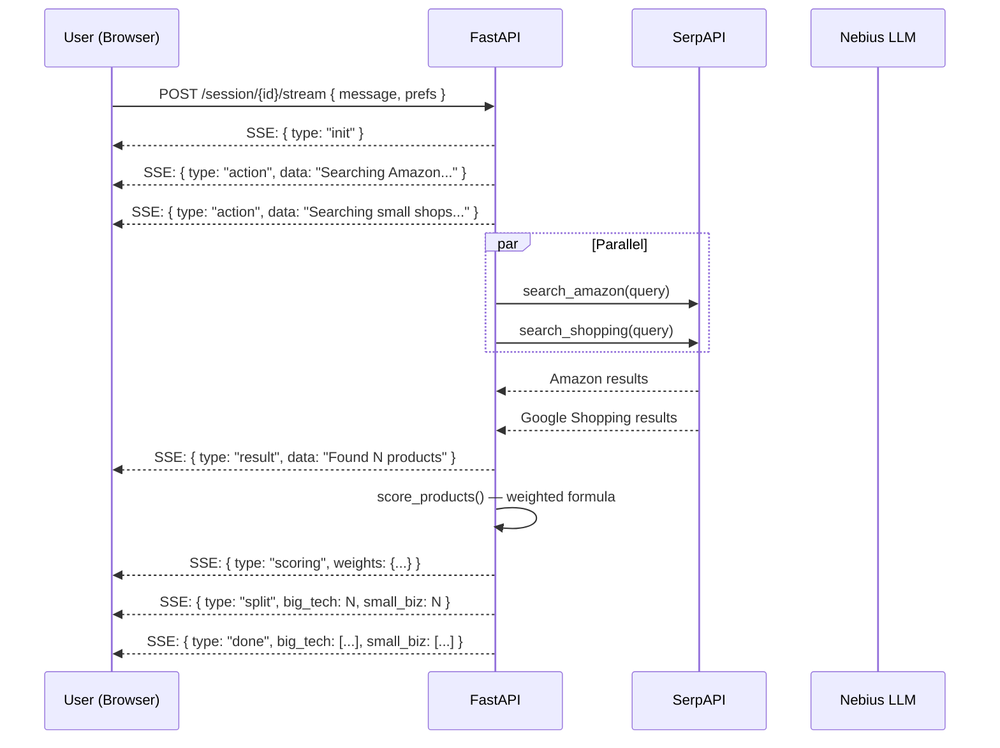

# ShopAgent

An agentic shopping assistant that searches Amazon, Etsy, and independent retailers in parallel, scores results by price, shipping speed, quality, and ethical sourcing, and streams live pipeline events to the browser.

Built on **Nebius AI Studio** (Llama 3.3 70B), **SerpAPI**, and **Next.js**.

---

## System Architecture

```
┌─────────────────────────────────────────────────────────────┐
│                        Browser (Next.js)                    │
│                                                             │
│   Search Input ──► POST /session/{id}/stream (SSE)         │
│                         │                                   │
│        ┌────────────────▼────────────────┐                  │
│        │         Pipeline Monitor        │  (BroadcastChannel)
│        │    live event log per request   │                  │
│        └─────────────────────────────────┘                  │
└─────────────────────────────────────────────────────────────┘
                          │ SSE stream
                          ▼
┌─────────────────────────────────────────────────────────────┐
│                     FastAPI Backend                         │
│                                                             │
│  ┌──────────────────┐    ┌──────────────────────────────┐   │
│  │  ShoppingAgent   │    │     ConversationAgent        │   │
│  │  (one-shot)      │    │     (multi-turn session)     │   │
│  └────────┬─────────┘    └──────────────┬───────────────┘   │
│           │                             │                   │
│           └──────────────┬──────────────┘                   │
│                          ▼                                  │
│               ┌──────────────────────┐                      │
│               │    SerpAPI Scraper   │                      │
│               │  search_amazon()     │                      │
│               │  search_shopping()   │                      │
│               └──────────┬───────────┘                      │
│                          │                                  │
│               ┌──────────▼───────────┐                      │
│               │   ReasoningAgent     │                      │
│               │   score_products()   │                      │
│               └──────────────────────┘                      │
└─────────────────────────────────────────────────────────────┘
                  │ OpenAI-compatible API
                  ▼
        ┌──────────────────────┐
        │  Nebius AI Studio    │
        │  Llama 3.3 70B       │
        └──────────────────────┘
```

---

## Agent Flow (Streaming Search)



---

## Agentic Loop (ReAct Pattern)

The `AgentLoop` in [backend/agents/agent_loop.py](backend/agents/agent_loop.py) implements a **Reason → Act → Observe** cycle. The LLM decides which tools to call on each turn — it is not scripted.

```
User query
    │
    ▼
┌───────────────────────────────────────────────────────┐
│  Turn 1..5  (max 5 LLM calls)                        │
│                                                       │
│  ┌──────────────┐                                     │
│  │  LLM call    │  ← system prompt + message history  │
│  │  (Llama 70B) │                                     │
│  └──────┬───────┘                                     │
│         │                                             │
│    has tool_calls?                                    │
│    ┌────┴──────────────────┐                          │
│   YES                      NO                         │
│    │                       │                          │
│    ▼                       ▼                          │
│  Execute tool          emit "done"                    │
│  search_amazon()       (LLM decided to stop)          │
│  search_shopping()                                    │
│  finalize()                                           │
│    │                                                  │
│    ▼                                                  │
│  Append tool result to messages                       │
│  → loop back to LLM call                             │
└───────────────────────────────────────────────────────┘
```

**Available tools exposed to the LLM:**

| Tool | Description |
|---|---|
| `search_amazon` | Search Amazon — price, rating, Prime shipping |
| `search_shopping` | Search Google Shopping — Etsy, boutiques, indie shops |
| `finalize` | Signal that enough results have been gathered |

The LLM emits a `thought` event (its reasoning text) before each tool call, which is forwarded to the Pipeline Monitor in real time.

---

## Conversational Refinement

After the first search, the `ConversationAgent` handles follow-up messages. The LLM reads the conversation history and picks one of three actions:

```
User follow-up: "make it under $50"
        │
        ▼
┌───────────────────────────────┐
│   ConversationAgent           │
│                               │
│   LLM reads history +         │
│   current top-6 products      │
│                               │
│   Returns JSON:               │
│   { action, refined_query,    │
│     prefs, response }         │
└──────────────┬────────────────┘
               │
   ┌───────────┼───────────────┐
   ▼           ▼               ▼
"search"    "rerank"        "answer"
   │           │               │
new SerpAPI  re-score       return text
search with  existing       (no new
refined query results with   search)
             new weights
```

**Scoring weights adjust automatically by preference:**

| Mode | Price | Shipping | Quality | Ethics |
|---|---|---|---|---|
| Default | 0.30 | 0.20 | 0.30 | 0.20 |
| Cheapest first | 0.55 | 0.10 | 0.20 | 0.15 |
| Fastest shipping | 0.15 | 0.50 | 0.20 | 0.15 |
| Small business priority | 0.20 | 0.15 | 0.25 | 0.40 |
| Eco-friendly / local | 0.15 | 0.10 | 0.30 | 0.45 |

---

## Project Structure

```
NebiusHack/
├── backend/
│   ├── agents/
│   │   ├── agent_loop.py          # ReAct loop — LLM + tool dispatch
│   │   ├── shopping_agent.py      # Fast one-shot: regex + SerpAPI + score
│   │   ├── conversation_agent.py  # Multi-turn: LLM decides search/rerank/answer
│   │   ├── reasoning_agent.py     # LLM utilities: intent, scoring, navigation
│   │   └── voice_agent.py         # Voice call via Pokulab API
│   ├── api/
│   │   ├── routes.py              # FastAPI endpoints + SSE generator
│   │   ├── models.py              # Pydantic models
│   │   └── session_store.py       # In-memory session state
│   └── scrapers/
│       ├── serpapi_scraper.py     # Amazon + Google Shopping via SerpAPI
│       └── tavily_scraper.py      # Tavily web search
└── frontend/
    └── src/
        ├── app/
        │   ├── page.tsx           # Main search UI
        │   └── monitor/page.tsx   # Pipeline Monitor (live event log)
        └── components/
            ├── ProductCard.tsx
            ├── ProductGrid.tsx
            ├── AgentLog.tsx
            └── LoadingState.tsx
```

---

## API Endpoints

| Method | Path | Description |
|---|---|---|
| `POST` | `/session` | Create a new conversation session |
| `POST` | `/session/{id}/stream` | Streaming search (SSE) — main search path |
| `POST` | `/session/{id}/chat` | Non-streaming chat turn |
| `GET` | `/session/{id}` | Get session history and cached products |
| `POST` | `/search` | One-shot search (no session) |
| `POST` | `/call` | Trigger a voice call to a business via Pokulab |

---

## Setup

### Backend

```bash
cd backend
python -m venv .venv && source .venv/bin/activate
pip install -r requirements.txt
```

Create `backend/.env`:

```
NEBIUS_API_KEY=...
SERPAPI_API_KEY=...
TAVILY_API_KEY=...
```

```bash
uvicorn main:app --reload --port 8000
```

### Frontend

```bash
cd frontend
npm install
npm run dev
```

Open `http://localhost:3000`. The Pipeline Monitor runs at `http://localhost:3000/monitor`.

---

## Key Technologies

| Component | Technology |
|---|---|
| LLM inference | Nebius AI Studio — Llama 3.3 70B Instruct |
| Product search | SerpAPI (Amazon + Google Shopping) |
| Web search | Tavily |
| Backend framework | FastAPI + Python asyncio |
| Streaming | Server-Sent Events (SSE) |
| Frontend | Next.js 14, React, Tailwind CSS |
| Inter-tab communication | BroadcastChannel API |
